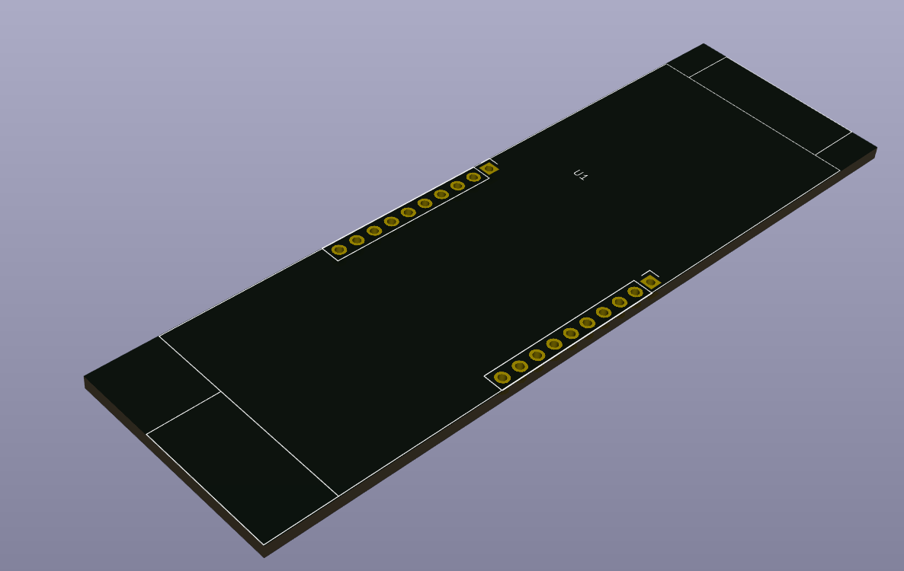
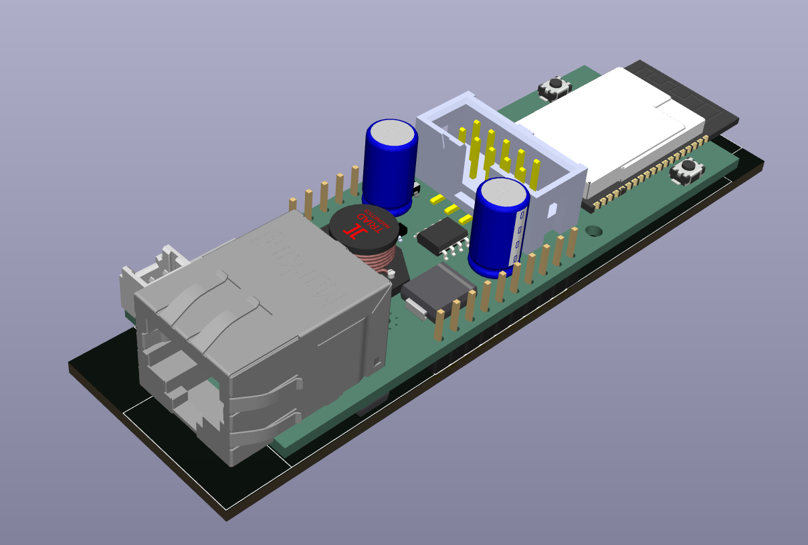

Molex PoE adapter
=================

A footprint to make adapter boards based on the Molex PoE board.

The Step file was used from the official [molex hardware repository](https://github.com/OLIMEX/ESP32-POE/tree/master/HARDWARE/ESP32-PoE-hardware-revision-L).

To add the library to KiCAD you can issue the following command:

    git submodule add https://github.com/besi/kicad-molex-poe lib/molex-poe
